<div align="center">

# MVP Engenharia de Dados

## Criminalidade no Estado do Rio de Janeiro

<br>

**Sprint:** Engenharia de Dados  
`40530010057_20260_01`

<br>

**Aluno:**  
### MATHEUS GABRIEL VIEIRA COIMBRA

<br>

**GitHub:**  
[github.com/MatheusVieira12](https://github.com/MatheusVieira12)

**Repositório do Projeto:**  
[mvp-engenharia-dados-seguranca-rj](https://github.com/MatheusVieira12/mvp-engenharia-dados-seguranca-rj)

<br>

---

### Databricks · PySpark · Delta Lake · Unity Catalog

</div>

<br>

### Sobre o projeto

Pipeline de dados construído no **Databricks Free Edition**, utilizando dados públicos do **Instituto de Segurança Pública do Rio de Janeiro (ISP-RJ)**, com o objetivo de analisar a evolução da criminalidade no estado, identificar concentrações geográficas de ocorrências e investigar a associação entre atividade policial e indicadores de criminalidade.

---

## Contexto de Negócio e Perguntas (Etapa 2 e 4.1)

### OBJETIVO

Entender como a criminalidade no Estado do Rio de Janeiro evoluiu ao longo de mais de duas décadas, identificar onde ela se concentra geograficamente e verificar se há indícios de que a atividade policial, medida por prisões em flagrante e cumprimento de mandados de prisão, está associada a variações subsequentes nos indicadores de crime.

### Perguntas de negócio

1. Como o volume de crimes violentos evoluiu por região do Estado do Rio de Janeiro entre 2003 e 2026?

2. Quais CISPs da Capital concentram os maiores volumes de crimes patrimoniais, considerando roubo de rua e furtos?

3. Existe associação entre a atividade policial de um mês, medida por prisões em flagrante e cumprimento de mandados de prisão, e a quantidade de crimes patrimoniais registrada no mês seguinte?

4. Como o índice de recuperação de veículos evoluiu ao longo dos anos e entre as regiões?

5. Como evoluíram mensalmente os registros de feminicídio e tentativa de feminicídio a partir de outubro de 2024?

6. Quais meses apresentam os maiores registros de roubo de rua e roubo a estabelecimento comercial em cada ano, e esses meses de maior ocorrência se repetem ao longo dos anos?

Nem todas as perguntas precisam ser respondidas com a mesma profundidade — a pergunta 3, em particular, é tratada como uma associação temporal exploratória, não como prova de causalidade (o nome "efetividade policial", usado numa versão inicial deste trabalho, foi deliberadamente evitado — ver ressalva completa na seção de Análise).


## FONTES DE DADOS E CONTEXTO


Todos os dados utilizados neste projeto foram obtidos junto ao **Instituto de Segurança Pública do Rio de Janeiro (ISP-RJ)**, responsável pela produção e divulgação das estatísticas criminais oficiais do estado.

Foram utilizados três arquivos principais:

| Arquivo | Grão | Período coberto | Linhas | Descrição |
|---|---|---:|---:|---|
| `BaseDPEvolucaoMensalCisp.csv` | CISP × ano × mês | 2003–2026 | 38.958 | Contagens absolutas de ocorrências por CISP. |
| `BaseMunicipioMensal.csv` | Município × ano × mês | 2014–2026 | 13.892 | Contagens absolutas de ocorrências por município. |
| `BaseMunicipioTaxaMes.csv` | Município × ano × mês | 2014–2024 | 12.144 | Indicadores em forma de taxa por 100 mil habitantes, veículos ou outras bases de referência, conforme o campo. |

### Links das fontes

```text
BaseDPEvolucaoMensalCisp.csv
https://www.ispdados.rj.gov.br/Arquivos/BaseDPEvolucaoMensalCisp.csv

BaseMunicipioMensal.csv
https://www.ispdados.rj.gov.br/Arquivos/BaseMunicipioMensal.csv

BaseMunicipioTaxaMes.csv
https://www.ispdados.rj.gov.br/Arquivos/BaseMunicipioTaxaMes.csv
```

Cada arquivo possui aproximadamente `55–61` colunas, abrangendo diferentes tipos de indicadores de segurança pública, entre eles:

- homicídio doloso;
- latrocínio;
- letalidade violenta;
- crimes de trânsito;
- roubos e furtos por modalidade;
- crimes contra o patrimônio;
- prisões em flagrante;
- apreensões;
- cumprimento de mandados.

Os dicionários oficiais de variáveis também foram incluídos no repositório:

```text
dp_municipio           BaseDpDicionarioDeVariaveis.xlsx
ocorrencias_municipio  BaseMunicipioMensalDicionarioDeVariaveis.xlsx
taxas_municipio        DicionarioDeVariaveisBaseMunicipioTaxaMes.xlsx
```

### Cobertura temporal das fontes

As três bases não possuem exatamente o mesmo período de cobertura:

```text
dp_municipio           → 2003 a 2026
ocorrencias_municipio  → 2014 a 2026
taxas_municipio        → 2014 a 2024
```

Essa diferença de cobertura foi preservada no pipeline e considerada durante as análises. Não foi realizado preenchimento artificial para períodos em que a fonte não disponibiliza dados.

Além disso, os registros de `2026` são parciais no conjunto utilizado, o que exige cautela ao comparar esse ano com períodos completos.

## LICENÇA DE USO

Os dados são publicados pelo ISP-RJ como dados abertos, no âmbito do Plano de Dados Abertos do Governo do Estado do Rio de Janeiro, com base na Lei de Acesso à Informação (Lei Federal nº 12.527/2011) e no Decreto Estadual nº 46.475/2018, que estabelecem o princípio da transparência ativa da administração pública. Os conjuntos de dados do ISP têm nível de acesso "Público" no catálogo oficial (dadosabertos.rj.gov.br) e estão disponíveis livremente no site do ISP (https://www.ispdados.rj.gov.br/) para uso por sociedade, pesquisadores e jornalistas. Não foi identificada uma licença Creative Commons explícita nos arquivos — o uso é amparado pelo caráter público e pela transparência ativa exigida por lei, mas recomenda-se citar o ISP-RJ como fonte em qualquer publicação derivada.

## CARGA DOS DADOS (Etapa 4.2)

#### Origem e envio dos arquivos

Os três arquivos CSV utilizados no projeto foram baixados diretamente do site do ISP-RJ e enviados para um volume do Unity Catalog, dentro do ambiente do Databricks Free Edition.

Os arquivos foram armazenados nos seguintes caminhos:

```text
BaseMunicipioMensal.csv
/Volumes/projeto_seguranca_rj/bronze/arquivos/BaseMunicipioMensal.csv

BaseMunicipioTaxaMes.csv
/Volumes/projeto_seguranca_rj/bronze/arquivos/BaseMunicipioTaxaMes.csv

BaseDPEvolucaoMensalCisp.csv
/Volumes/projeto_seguranca_rj/bronze/arquivos/BaseDPEvolucaoMensalCisp.csv

```

#### Leitura e persistência na camada Bronze

Após o envio dos arquivos para o volume do Unity Catalog, cada CSV foi lido por meio de um Notebook no Databricks, utilizando **PySpark**.

Em seguida, os dados foram persistidos como **tabelas Delta** na camada Bronze.

Nesta etapa, nenhuma transformação de limpeza, padronização ou alteração dos dados foi realizada. O objetivo foi manter os dados da mesma forma em que foram disponibilizados originalmente pelo ISP-RJ, preservando o conteúdo bruto e permitindo maior rastreabilidade ao longo do pipeline.

Colunas de controle

Foram adicionadas apenas duas colunas de controle durante o processo de ingestão:

* **fonte_arquivo**: identifica o nome do arquivo CSV de origem de cada registro;

* **data_ingestao**: registra o timestamp correspondente ao momento em que a ingestão dos dados foi executada.

Essas informações foram incluídas para facilitar a identificação da origem dos registros e o acompanhamento das execuções do processo de carga.

#### Papel da camada Bronze

A camada Bronze funciona como o primeiro nível do pipeline de dados deste projeto. Nela, os dados são armazenados de forma próxima à sua estrutura original, antes das etapas de limpeza e transformação realizadas posteriormente.

O fluxo desta etapa pode ser resumido da seguinte forma:
```text
Arquivos CSV do ISP-RJ
        ↓
Upload para o Unity Catalog
        ↓
Leitura com PySpark
        ↓
Adição das colunas de controle
        ↓
Persistência como tabelas Delta
        ↓
Camada Bronze
```
#### Código utilizado

O código responsável pela leitura dos arquivos e pela criação das tabelas Delta da camada Bronze está disponível no notebook correspondente deste repositório.

Notebook de ingestão Bronze:  [`01_bronze_seguranca_rj.ipynb`](notebooks/01_bronze_seguranca_rj.ipynb)

#### Tabelas Bronze geradas:

### `projeto_seguranca_rj.bronze.dp_municipio`

<p align="center">
  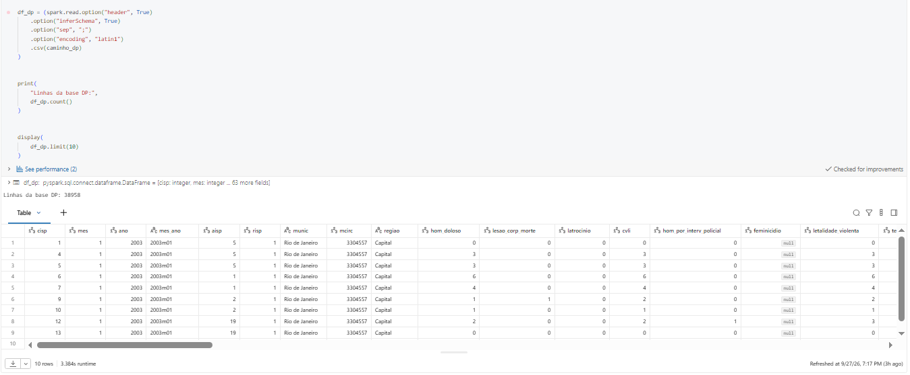
</p>

<p align="center">
  <em>Evidência da persistência da tabela <code>bronze.dp_municipio</code> no ambiente Databricks.</em>
</p>

### `projeto_seguranca_rj.bronze.ocorrencias_municipio`

<p align="center">
  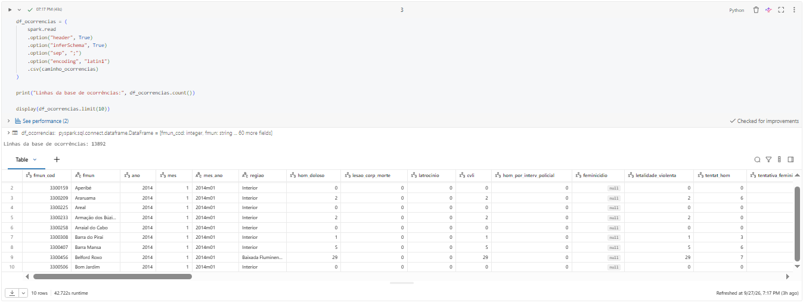
</p>

<p align="center">
  <em>Evidência da persistência da tabela <code>bronze.ocorrencias_municipio</code> no ambiente Databricks.</em>
</p>

### `projeto_seguranca_rj.bronze.taxas_municipio`

<p align="center">
  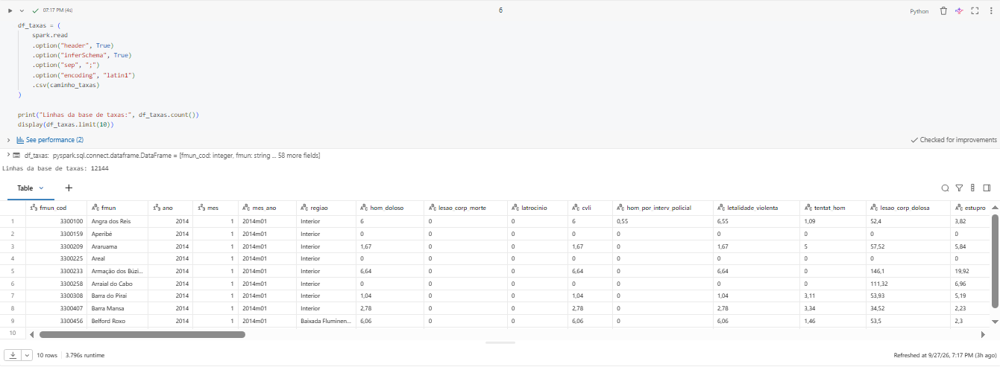
</p>

<p align="center">
  <em>Evidência da persistência da tabela <code>bronze.taxas_municipio</code> no ambiente Databricks.</em>
</p>

## MODELAGEM E CATÁLOGO DE DADOS (Etapa 4.3)

#### Modelo escolhido
Foi adotada uma **modelagem estrela simplificada** dentro do Lakehouse: duas dimensões (tempo, município) e dois fatos, um por granularidade de análise (município e CISP).

```text
dim_tempo                        (data_referencia, ano, mes, ano_mes, trimestre, semestre)
dim_municipio                    (fmun_cod, municipio, regiao)
fato_criminalidade_municipio     (grão: fmun_cod × ano × mes — 2014-2026)
fato_criminalidade_cisp          (grão: cisp × ano × mes — 2003-2026)
```

### Decisão de modelagem: ausência de `dim_cisp`

Uma versão inicial do modelo previa uma quarta dimensão, denominada `dim_cisp`, destinada a armazenar separadamente os atributos relacionados às delegacias, como `cisp`, `aisp`, `risp`, `mcirc`, `munic` e `regiao`.

Durante o desenvolvimento, optou-se por remover essa dimensão e manter esses atributos diretamente na tabela `fato_criminalidade_cisp`.

Essa decisão foi tomada principalmente por dois motivos:

- **Simplicidade proporcional ao escopo do MVP:** como apenas uma tabela fato utiliza esses atributos, a criação de uma dimensão separada acrescentaria uma etapa adicional de `JOIN` sem trazer ganho significativo para as análises realizadas neste projeto.

- **Preservação do histórico:** manter os atributos da CISP na própria linha mensal da tabela fato permite preservar exatamente a classificação registrada pela fonte em cada período. Caso uma CISP tenha sua circunscrição ou classificação alterada ao longo da série histórica, o valor correspondente a cada mês permanece registrado. Uma dimensão simples, contendo apenas uma linha por CISP e sem controle de versões históricas, poderia perder essa informação.

Por esse motivo, o modelo adotado não corresponde a um esquema estrela em sua forma mais rígida. Ele combina características de modelagem dimensional com uma estrutura mais próxima de um modelo `flat` para os atributos da CISP.

Essa simplificação foi adotada de forma deliberada, considerando o escopo do MVP e as necessidades das análises propostas.

#### Limitação da modelagem

A tabela `fato_criminalidade_cisp` não possui o código IBGE do município (`fmun_cod`). A fonte por CISP disponibiliza apenas o nome do município por meio do campo `munic`.

Por esse motivo, não existe uma chave direta entre `fato_criminalidade_cisp` e `dim_municipio`.

Quando é necessário trabalhar com informações presentes nas duas granularidades, o atributo comum disponível no modelo é `regiao`, presente tanto nos dados por CISP quanto nos dados municipais.

### CATÁLOGO DE DADOS

### BRONZE

A camada Bronze preserva a estrutura dos arquivos CSV disponibilizados pelo ISP-RJ, acrescentando apenas as colunas de controle `fonte_arquivo` e `data_ingestao`.

Foram utilizados como referência os três dicionários oficiais disponibilizados pelo ISP-RJ:

| Tabela Bronze | Arquivo de origem | Dicionário de referência |
|---|---|---|
| `bronze.dp_municipio` | `BaseDPEvolucaoMensalCisp.csv` | `BaseDpDicionarioDeVariaveis.xlsx` |
| `bronze.ocorrencias_municipio` | `BaseMunicipioMensal.csv` | `BaseMunicipioMensalDicionarioDeVariaveis.xlsx` |
| `bronze.taxas_municipio` | `BaseMunicipioTaxaMes.csv` | `DicionarioDeVariaveisBaseMunicipioTaxaMes.xlsx` |

> Os dicionários oficiais consultados indicam última atualização em janeiro de 2021. Os arquivos utilizados no projeto são versões mais recentes e incluem alguns campos adicionais, como `feminicidio` e `tentativa_feminicidio`, presentes nas bases atuais de contagens.

#### Campos de identificação, localização e controle

| Campo | Tabelas | Tipo na Bronze | Descrição | Domínio / observação |
|---|---|---|---|---|
| `cisp` | `dp_municipio` | `int` | Número da Circunscrição Integrada de Segurança Pública onde ocorreu o fato. | Código identificador de CISP. |
| `aisp` | `dp_municipio` | `int` | Número da Área Integrada de Segurança Pública. | Código identificador de AISP. Algumas DPs mudaram de AISP ao longo da série histórica. |
| `risp` | `dp_municipio` | `int` | Número da Região Integrada de Segurança Pública. | Código identificador de RISP. |
| `munic` | `dp_municipio` | `string` | Nome do município da circunscrição. | Municípios do Estado do Rio de Janeiro ou agrupamentos definidos pela fonte. |
| `mcirc` | `dp_municipio` | `int` | Código IBGE de 7 dígitos do município da circunscrição. | Código identificador; algumas circunscrições sofreram alterações históricas. |
| `fmun_cod` | `ocorrencias_municipio`, `taxas_municipio` | `int` | Código IBGE de 7 dígitos do município. | Código identificador do município. |
| `fmun` | `ocorrencias_municipio`, `taxas_municipio` | `string` | Nome do município. | Municípios do Estado do Rio de Janeiro. |
| `ano` | todas | `int` | Ano da comunicação da ocorrência. | Ano referente ao registro. |
| `mes` | todas | `int` | Mês da comunicação da ocorrência. | Valores de `1` a `12`. |
| `mes_ano` | todas | `string` | Mês e ano da comunicação da ocorrência. | Referência textual mensal da fonte. |
| `regiao` | todas | `string` | Região associada ao registro. | Baixada Fluminense, Capital, Grande Niterói ou Interior. |
| `fase` | todas | `int` | Fase de consolidação do dado. | `2` = consolidado sem errata; `3` = consolidado com errata. |
| `fonte_arquivo` | todas | `string` | Nome do arquivo CSV utilizado na ingestão. | Coluna de controle adicionada pelo pipeline. |
| `data_ingestao` | todas | `timestamp` | Data e hora em que o registro foi carregado na Bronze. | Coluna de controle adicionada pelo pipeline. |

#### Indicadores criminais e de atividade policial

Os campos abaixo são compartilhados, em sua maioria, pelas três fontes. Nas bases `dp_municipio` e `ocorrencias_municipio`, representam **contagens absolutas** e são armazenados como `integer`. Na base `taxas_municipio`, representam **taxas** e são inicialmente armazenados como `string` na Bronze devido ao uso de vírgula como separador decimal.

| Campo | Descrição | Unidade nas bases de contagem | Unidade em `taxas_municipio` | Domínio esperado |
|---|---|---|---|---|
| `hom_doloso` | Homicídio doloso | Vítimas | Taxa por 100 mil habitantes | Valores ≥ 0 |
| `lesao_corp_morte` | Lesão corporal seguida de morte | Vítimas | Taxa por 100 mil habitantes | Valores ≥ 0 |
| `latrocinio` | Latrocínio — roubo seguido de morte | Vítimas | Taxa por 100 mil habitantes | Valores ≥ 0 |
| `cvli` | Crimes Violentos Letais Intencionais | Vítimas | Taxa por 100 mil habitantes | `hom_doloso + lesao_corp_morte + latrocinio` |
| `hom_por_interv_policial` | Morte por intervenção de agente do Estado | Vítimas | Taxa por 100 mil habitantes | Valores ≥ 0 |
| `letalidade_violenta` | Letalidade violenta | Vítimas | Taxa por 100 mil habitantes | Soma dos quatro componentes de letalidade documentados pelo ISP-RJ |
| `tentat_hom` | Tentativa de homicídio | Vítimas | Taxa por 100 mil habitantes | Valores ≥ 0 |
| `lesao_corp_dolosa` | Lesão corporal dolosa | Vítimas | Taxa por 100 mil habitantes | Valores ≥ 0 |
| `estupro` | Estupro | Vítimas | Taxa por 100 mil habitantes | Valores ≥ 0 |
| `hom_culposo` | Homicídio culposo de trânsito | Vítimas | Taxa por 100 mil habitantes | Valores ≥ 0 |
| `lesao_corp_culposa` | Lesão corporal culposa de trânsito | Vítimas | Taxa por 100 mil habitantes | Valores ≥ 0 |
| `roubo_transeunte` | Roubo a transeunte | Casos | Taxa por 100 mil habitantes | Valores ≥ 0 |
| `roubo_celular` | Roubo de telefone celular | Casos | Taxa por 100 mil habitantes | Valores ≥ 0 |
| `roubo_em_coletivo` | Roubo em coletivo | Casos | Taxa por 100 mil habitantes | Valores ≥ 0 |
| `roubo_rua` | Roubo de rua | Casos | Taxa por 100 mil habitantes | Soma de roubo a transeunte, celular e coletivo |
| `roubo_veiculo` | Roubo de veículo | Casos | Taxa por 100 mil veículos | Valores ≥ 0 |
| `roubo_carga` | Roubo de carga | Casos | Taxa por 100 mil habitantes | Valores ≥ 0 |
| `roubo_comercio` | Roubo a estabelecimento comercial | Casos | Taxa por 100 mil habitantes | Valores ≥ 0 |
| `roubo_residencia` | Roubo a residência | Casos | Taxa por 100 mil habitantes | Valores ≥ 0 |
| `roubo_banco` | Roubo a banco | Casos | Taxa por 100 mil habitantes | Valores ≥ 0 |
| `roubo_cx_eletronico` | Roubo de caixa eletrônico | Casos | Taxa por 100 mil habitantes | Valores ≥ 0 |
| `roubo_conducao_saque` | Roubo com condução da vítima para saque em instituição financeira | Casos | Taxa por 100 mil habitantes | Valores ≥ 0 |
| `roubo_apos_saque` | Roubo após saque em instituição financeira | Casos | Taxa por 100 mil habitantes | Valores ≥ 0 |
| `roubo_bicicleta` | Roubo de bicicleta | Casos | Taxa por 100 mil habitantes | Valores ≥ 0 |
| `outros_roubos` | Outros roubos não listados individualmente | Casos | Taxa por 100 mil habitantes | Inclui ocorrências de latrocínio segundo o dicionário da fonte |
| `total_roubos` | Total de roubos | Casos | Taxa por 100 mil habitantes | Soma das modalidades de roubo |
| `furto_veiculos` | Furto de veículo | Casos | Taxa por 100 mil veículos | Valores ≥ 0 |
| `furto_transeunte` | Furto a transeunte | Casos | Taxa por 100 mil habitantes | Valores ≥ 0 |
| `furto_coletivo` | Furto em coletivo | Casos | Taxa por 100 mil habitantes | Valores ≥ 0 |
| `furto_celular` | Furto de telefone celular | Casos | Taxa por 100 mil habitantes | Valores ≥ 0 |
| `furto_bicicleta` | Furto de bicicleta | Casos | Taxa por 100 mil habitantes | Valores ≥ 0 |
| `outros_furtos` | Outros furtos não listados individualmente | Casos | Taxa por 100 mil habitantes | Valores ≥ 0 |
| `total_furtos` | Total de furtos | Casos | Taxa por 100 mil habitantes | Soma das modalidades de furto |
| `sequestro` | Extorsão mediante sequestro | Vítimas | Taxa por 100 mil habitantes | Valores ≥ 0 |
| `extorsao` | Extorsão | Casos | Taxa por 100 mil habitantes | Valores ≥ 0 |
| `sequestro_relampago` | Extorsão com momentânea privação da liberdade | Vítimas | Taxa por 100 mil habitantes | Valores ≥ 0 |
| `estelionato` | Estelionato | Casos | Taxa por 100 mil habitantes | Valores ≥ 0 |
| `apreensao_drogas` | Apreensão de drogas | Casos | Taxa por 100 mil habitantes | Agregação de registros relacionados a uso/porte, tráfico e apreensão |
| `posse_drogas` | Registros relacionados à posse de drogas | Casos | Taxa por 100 mil habitantes | Valores ≥ 0 |
| `trafico_drogas` | Registros relacionados ao tráfico de drogas | Casos | Taxa por 100 mil habitantes | Valores ≥ 0 |
| `apreensao_drogas_sem_autor` | Registros de apreensão de drogas sem autor | Casos | Taxa por 100 mil habitantes | Valores ≥ 0 |
| `recuperacao_veiculos` | Recuperação de veículo | Casos | Taxa por 100 mil veículos | O veículo pode ter sido subtraído em outro mês ou em outra área |
| `apf` | Auto de Prisão em Flagrante | Autores | Taxa por 100 mil habitantes | Valores ≥ 0 |
| `aaapai` | Auto de Apreensão de Adolescente por Prática de Ato Infracional | Adolescentes infratores | Taxa por 100 mil habitantes | Valores ≥ 0 |
| `cmp` | Cumprimento de Mandado de Prisão | Autores | Taxa por 100 mil habitantes | Valores ≥ 0 |
| `cmba` | Cumprimento de Mandado de Busca e Apreensão | Adolescentes infratores | Taxa por 100 mil habitantes | Valores ≥ 0 |
| `ameaca` | Ameaça | Vítimas | Taxa por 100 mil habitantes | Valores ≥ 0 |
| `pessoas_desaparecidas` | Pessoas desaparecidas | Vítimas | Taxa por 100 mil habitantes | Valores ≥ 0 |
| `encontro_cadaver` | Encontro de cadáver | Vítimas | Taxa por 100 mil habitantes | Valores ≥ 0 |
| `encontro_ossada` | Encontro de ossada | Vítimas | Taxa por 100 mil habitantes | Valores ≥ 0 |
| `pol_militares_mortos_serv` | Policiais Militares mortos em serviço | Vítimas | Taxa por 100 mil policiais | Valores ≥ 0 |
| `pol_civis_mortos_serv` | Policiais Civis mortos em serviço | Vítimas | Taxa por 100 mil policiais | Valores ≥ 0 |
| `registro_ocorrencias` | Total de registros de ocorrências divulgados no mês | Casos | Taxa por 100 mil habitantes | Valores ≥ 0 |

#### Campos adicionados nas versões mais recentes das bases

Os dicionários oficiais consultados foram atualizados em janeiro de 2021 e, portanto, não apresentam os campos abaixo. Eles estão presentes nos arquivos atuais `BaseDPEvolucaoMensalCisp.csv` e `BaseMunicipioMensal.csv` utilizados neste projeto.

| Campo | Tabelas | Tipo na Bronze | Descrição utilizada no projeto | Domínio |
|---|---|---|---|---|
| `feminicidio` | `dp_municipio`, `ocorrencias_municipio` | `int` | Número de registros de feminicídio disponibilizados pela fonte atual. | Inteiros ≥ 0 ou `NULL` nos períodos anteriores à disponibilização do indicador |
| `tentativa_feminicidio` | `dp_municipio`, `ocorrencias_municipio` | `int` | Número de registros de tentativa de feminicídio disponibilizados pela fonte atual. | Inteiros ≥ 0 ou `NULL` nos períodos anteriores à disponibilização do indicador |

#### Tipos dos indicadores na Bronze

| Tabela | Tipo dos indicadores |
|---|---|
| `bronze.dp_municipio` | `integer` para os indicadores de contagem |
| `bronze.ocorrencias_municipio` | `integer` para os indicadores de contagem |
| `bronze.taxas_municipio` | `string` na ingestão, pois os valores decimais chegam com vírgula; a conversão para `double` ocorre na Silver |

#### Linhagem da camada Bronze

| Tabela Bronze | Origem | Transformações na ingestão |
|---|---|---|
| `bronze.dp_municipio` | `BaseDPEvolucaoMensalCisp.csv` | Preservação dos campos da fonte + `fonte_arquivo` e `data_ingestao` |
| `bronze.ocorrencias_municipio` | `BaseMunicipioMensal.csv` | Preservação dos campos da fonte + `fonte_arquivo` e `data_ingestao` |
| `bronze.taxas_municipio` | `BaseMunicipioTaxaMes.csv` | Preservação dos campos da fonte + `fonte_arquivo` e `data_ingestao` |

Nenhuma limpeza, deduplicação, substituição de valores ou padronização dos indicadores é realizada na camada Bronze. Esses tratamentos são executados posteriormente na camada Silver.

### SILVER 

A camada Silver é derivada diretamente das três tabelas Bronze. Os indicadores criminais mantêm o mesmo significado, unidade e definição apresentados no catálogo da camada Bronze e nos dicionários oficiais do ISP-RJ.

Nesta camada são realizados tratamentos de qualidade, padronização, tipagem e validação. Portanto, o catálogo abaixo destaca a estrutura final de cada tabela e as alterações realizadas em relação à Bronze.

---

#### `projeto_seguranca_rj.silver.dp_municipio`

**Origem:** `projeto_seguranca_rj.bronze.dp_municipio`

**Grão / chave utilizada no tratamento:**

```text
cisp + munic + ano + mes
```

A tabela mantém os indicadores criminais da fonte por CISP, após tratamento de duplicidades, valores nulos e padronização dos campos de identificação.

| Campo / grupo | Tipo na Silver | Descrição / tratamento | Domínio |
|---|---|---|---|
| `cisp` | `string` | Código da Circunscrição Integrada de Segurança Pública. Convertido de número para texto por representar um identificador. | Códigos de CISP presentes na fonte |
| `aisp` | `string` | Código da Área Integrada de Segurança Pública. | Códigos de AISP presentes na fonte |
| `risp` | `string` | Código da Região Integrada de Segurança Pública. | Códigos de RISP presentes na fonte |
| `mcirc` | `string` | Código do município associado à circunscrição. Convertido para texto por ser identificador. | Códigos presentes na fonte |
| `munic` | `string` | Município associado à CISP no respectivo período. | Municípios registrados pela fonte |
| `regiao` | `string` | Região de segurança pública. Valores com problemas de encoding contendo `Niter` foram padronizados para `Grande Niterói`. | `Capital`, `Baixada Fluminense`, `Grande Niterói`, `Interior` |
| `ano` | `int` | Ano de referência do registro. | 2003–2026 no conjunto utilizado |
| `mes` | `int` | Mês de referência. | 1–12 |
| `mes_ano` | `string` | Representação textual de mês e ano herdada da fonte. | Valores mensais da fonte |
| `fase` | `int` | Fase de consolidação do registro. Utilizada na resolução de duplicidades. | `2` ou `3` |
| `fonte_arquivo` | `string` | Nome do arquivo utilizado na ingestão. | `BaseDPEvolucaoMensalCisp.csv` |
| `data_ingestao` | `timestamp` | Data e hora da execução da carga Bronze. | Timestamp de ingestão |

Os indicadores criminais permanecem como contagens inteiras não negativas, mantendo as definições apresentadas no catálogo Bronze.

Os campos abaixo apresentavam valores nulos em determinados períodos e foram tratados com `coalesce()`, substituindo `NULL` por `0`:

```text
feminicidio
tentativa_feminicidio
roubo_cx_eletronico
roubo_bicicleta
furto_bicicleta
posse_drogas
trafico_drogas
apreensao_drogas_sem_autor
apf
aaapai
cmp
cmba
```

Após o tratamento:

| Campos | Tipo | Domínio |
|---|---|---|
| Indicadores criminais e policiais | `int` | Inteiros ≥ 0 |
| Campos tratados com `coalesce()` | `int` | Inteiros ≥ 0, sem `NULL` após o tratamento |

> O valor `0` nos períodos anteriores à disponibilização de alguns indicadores não deve ser interpretado automaticamente como ausência de ocorrência. Essa limitação foi considerada nas análises, especialmente nos indicadores de feminicídio.

##### Tratamento de duplicidades

Inicialmente são removidas linhas completamente idênticas utilizando:

```python
dropDuplicates()
```

Quando existem registros com a mesma combinação:

```text
cisp + munic + ano + mes
```

mas com diferentes valores de `fase`, é mantido o registro com a maior `fase`, utilizando uma janela com `row_number()` ordenada por `fase` de forma decrescente.

Ao final do processo é realizada uma nova validação de unicidade para garantir que exista apenas uma linha por chave.

##### Linhagem

```text
BaseDPEvolucaoMensalCisp.csv
        ↓
bronze.dp_municipio
        ↓
tipagem de identificadores
tratamento de nulos
remoção de duplicatas exatas
seleção da maior fase por chave
padronização de regiao
        ↓
silver.dp_municipio
```

---

#### `projeto_seguranca_rj.silver.ocorrencias_municipio`

**Origem:** `projeto_seguranca_rj.bronze.ocorrencias_municipio`

**Grão / chave:**

```text
fmun_cod + ano + mes
```

A tabela mantém as contagens mensais de ocorrências por município e adiciona uma representação temporal padronizada para uso nas etapas posteriores.

| Campo / grupo | Tipo na Silver | Descrição / tratamento | Domínio |
|---|---|---|---|
| `fmun_cod` | `string` | Código IBGE do município. Convertido para texto porque representa um identificador. | Códigos IBGE presentes na fonte |
| `fmun` | `string` | Nome do município. | Municípios do Estado do Rio de Janeiro |
| `regiao` | `string` | Região associada ao município. | `Capital`, `Baixada Fluminense`, `Grande Niterói`, `Interior` |
| `ano` | `int` | Ano de referência. | 2014–2026 no conjunto utilizado |
| `mes` | `int` | Mês de referência. | 1–12 |
| `mes_ano` | `string` | Referência textual de mês e ano herdada da fonte. | Valores mensais da fonte |
| `fase` | `int` | Fase de consolidação do registro. | Valores disponibilizados pela fonte |
| `data_referencia` | `date` | Data criada a partir de `ano` e `mes`, utilizando o primeiro dia do mês como convenção temporal. | Datas mensais no formato `AAAA-MM-01` |
| `fonte_arquivo` | `string` | Nome do arquivo utilizado na ingestão. | `BaseMunicipioMensal.csv` |
| `data_ingestao` | `timestamp` | Data e hora da execução da carga Bronze. | Timestamp de ingestão |

Os indicadores criminais permanecem como contagens inteiras não negativas e mantêm as mesmas definições do catálogo Bronze.

Os campos:

```text
feminicidio
tentativa_feminicidio
```

possuíam valores nulos nos períodos anteriores à disponibilização desses indicadores. Na Silver esses valores foram convertidos para `0` utilizando `coalesce()`.

| Campos | Tipo | Domínio após tratamento |
|---|---|---|
| Indicadores criminais | `int` | Inteiros ≥ 0 |
| `feminicidio` | `int` | Inteiros ≥ 0, sem `NULL` |
| `tentativa_feminicidio` | `int` | Inteiros ≥ 0, sem `NULL` |

A chave:

```text
fmun_cod + ano + mes
```

foi validada e não apresentou duplicidades na versão utilizada no projeto.

Também foi realizada uma validação dos campos obrigatórios:

```text
fmun_cod
fmun
ano
mes
```

para evitar a persistência de registros sem identificação temporal ou municipal.

##### Criação de `data_referencia`

A coluna foi construída da seguinte forma:

```text
ano = 2024
mes = 10

→ data_referencia = 2024-10-01
```

O dia `01` não representa a data da ocorrência. Ele é utilizado apenas como convenção para representar o respectivo mês em um campo do tipo `date`.

##### Linhagem

```text
BaseMunicipioMensal.csv
        ↓
bronze.ocorrencias_municipio
        ↓
conversão de fmun_cod para string
validação de chave
tratamento dos nulos de feminicídio
criação de data_referencia
        ↓
silver.ocorrencias_municipio
```

---

#### `projeto_seguranca_rj.silver.taxas_municipio`

**Origem:** `projeto_seguranca_rj.bronze.taxas_municipio`

**Grão / chave:**

```text
fmun_cod + ano + mes
```

Essa tabela representa os indicadores em forma de taxa. Na Bronze, os valores numéricos chegam como `string`, utilizando vírgula como separador decimal. Na Silver eles são convertidos para valores numéricos.

| Campo / grupo | Tipo na Silver | Descrição / tratamento | Domínio |
|---|---|---|---|
| `fmun_cod` | `string` | Código IBGE do município. Convertido para texto por representar um identificador. | Códigos IBGE presentes na fonte |
| `fmun` | `string` | Nome do município. | Municípios do Estado do Rio de Janeiro |
| `regiao` | `string` | Região associada ao município. Valores nulos foram substituídos por `NAO_INFORMADO`. | `Capital`, `Baixada Fluminense`, `Grande Niterói`, `Interior`, `NAO_INFORMADO` |
| `ano` | `int` | Ano de referência. | 2014–2024 no conjunto utilizado |
| `mes` | `int` | Mês de referência. | 1–12 |
| `mes_ano` | `string` | Referência textual de mês e ano herdada da fonte. | Valores mensais da fonte |
| `fase` | `int` | Fase de consolidação do registro. | Valores disponibilizados pela fonte |
| `fonte_arquivo` | `string` | Nome do arquivo utilizado na ingestão. | `BaseMunicipioTaxaMes.csv` |
| `data_ingestao` | `timestamp` | Data e hora da execução da carga Bronze. | Timestamp de ingestão |

##### Conversão dos indicadores de taxa

As `53` colunas de taxas recebidas como texto são convertidas para `double`.

O tratamento aplicado é:

```text
"0,55"
   ↓
substituição da vírgula pelo ponto
   ↓
"0.55"
   ↓
cast para double
   ↓
0.55
```

As colunas convertidas são:

```text
hom_doloso
lesao_corp_morte
latrocinio
cvli
hom_por_interv_policial
letalidade_violenta
tentat_hom
lesao_corp_dolosa
estupro
hom_culposo
lesao_corp_culposa
roubo_transeunte
roubo_celular
roubo_em_coletivo
roubo_rua
roubo_veiculo
roubo_carga
roubo_comercio
roubo_residencia
roubo_banco
roubo_cx_eletronico
roubo_conducao_saque
roubo_apos_saque
roubo_bicicleta
outros_roubos
total_roubos
furto_veiculos
furto_transeunte
furto_coletivo
furto_celular
furto_bicicleta
outros_furtos
total_furtos
sequestro
extorsao
sequestro_relampago
estelionato
apreensao_drogas
posse_drogas
trafico_drogas
apreensao_drogas_sem_autor
recuperacao_veiculos
apf
aaapai
cmp
cmba
ameaca
pessoas_desaparecidas
encontro_cadaver
encontro_ossada
pol_militares_mortos_serv
pol_civis_mortos_serv
registro_ocorrencias
```

Após a transformação:

| Campos | Tipo na Bronze | Tipo na Silver | Domínio |
|---|---|---|---|
| 53 indicadores de taxa | `string` | `double` | Valores decimais ≥ 0 |
| `fmun_cod` | `int` | `string` | Código identificador |
| `regiao` | `string` | `string` | Categorias regionais ou `NAO_INFORMADO` |

A conversão das 53 colunas é validada após o `cast`. Caso algum valor não possa ser convertido adequadamente e resulte em `NULL`, a validação interrompe o pipeline.

##### Tratamento dos nulos de `regiao`

Foram encontrados `3` registros com:

```text
regiao = NULL
```

Esses registros foram preservados e receberam:

```text
NAO_INFORMADO
```

Nenhuma região existente foi atribuída artificialmente aos registros.

A chave:

```text
fmun_cod + ano + mes
```

também foi validada e não apresentou duplicidades na versão utilizada.

##### Linhagem

```text
BaseMunicipioTaxaMes.csv
        ↓
bronze.taxas_municipio
        ↓
conversão de fmun_cod para string
vírgula → ponto nas taxas
conversão de 53 indicadores para double
tratamento de regiao nula
validação da chave
        ↓
silver.taxas_municipio
```

---

#### Resumo das alterações Bronze → Silver

| Tabela Silver | Principais alterações |
|---|---|
| `silver.dp_municipio` | Identificadores convertidos para `string`; tratamento de nulos; remoção de duplicatas exatas; seleção da maior `fase`; padronização de `Grande Niterói`; validação de unicidade |
| `silver.ocorrencias_municipio` | `fmun_cod` convertido para `string`; tratamento de nulos em `feminicidio` e `tentativa_feminicidio`; criação de `data_referencia`; validação dos campos obrigatórios e da chave |
| `silver.taxas_municipio` | `fmun_cod` convertido para `string`; 53 taxas convertidas para `double`; 3 valores nulos de `regiao` tratados como `NAO_INFORMADO`; validação da conversão e da chave |

As descrições semânticas dos indicadores permanecem as mesmas apresentadas no catálogo da camada Bronze. A camada Silver altera principalmente a representação técnica e a qualidade dos dados, sem modificar o significado dos indicadores originais.

<p align="center">
  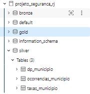
</p>

<p align="center">
  <em>Evidência das tabelas <code>silver.dp_municipio</code>, <code>silver.ocorrencias_municipio</code> e <code>silver.taxas_municipio</code> persistidas no Unity Catalog do Databricks.</em>
</p>


### GOLD — Catálogo detalhado (tabelas criadas nesta etapa, sem dicionário externo)

### `dim_tempo`

| Coluna | Tipo | Descrição | Domínio |
|---|---|---|---|
| `data_referencia` | `date` | Primeiro dia do mês de referência | 2003-01-01 a 2026-mm-01 |
| `ano` | `int` | Ano de referência | 2003–2026 |
| `mes` | `int` | Mês de referência | 1–12 |
| `ano_mes` | `string` | Ano e mês no formato `AAAA-MM` | Ex.: `2014-01` |
| `trimestre` | `int` | Trimestre do ano | 1–4 |
| `semestre` | `int` | Semestre do ano | 1–2 |

**Linhagem:** construída a partir da união das combinações de `ano` e `mes` presentes em `silver.dp_municipio` e `silver.ocorrencias_municipio`, com remoção de registros duplicados.

#### `dim_municipio`

| Coluna | Tipo | Descrição | Domínio |
|---|---|---|---|
| `fmun_cod` | `string` | Código IBGE de 7 dígitos do município | Ex.: `3304557` |
| `municipio` | `string` | Nome do município | 92 municípios do RJ |
| `regiao` | `string` | Região de segurança pública | Capital / Baixada Fluminense / Grande Niterói / Interior |

**Linhagem:** derivada de `silver.ocorrencias_municipio`. Para cada município, foi mantida a classificação de região mais recente disponível, evitando inconsistências caso houvesse alguma reclassificação regional ao longo da série histórica.

### `fato_criminalidade_municipio`
**Grão:** `fmun_cod × ano × mes`

| Coluna | Tipo | Descrição | Domínio |
|---|---|---|---|
| `fmun_cod`, `fmun`, `regiao`, `ano`, `mes` | `string/int` | Chave do grão e descritores herdados de `silver.ocorrencias_municipio`. | Códigos e valores válidos presentes na base |
| `hom_doloso`, `lesao_corp_morte`, `latrocinio`, `hom_por_interv_policial` | `int` | Componentes de letalidade violenta. | Inteiros ≥ 0 |
| `letalidade_violenta` | `int` | Campo oficial do ISP-RJ, documentado como indicador composto por `hom_doloso`, `lesao_corp_morte`, `latrocinio` e `hom_por_interv_policial`. A consistência dessa composição foi verificada na etapa de Qualidade de Dados. | Inteiros ≥ 0 |
| `tentat_hom`, `lesao_corp_dolosa`, `estupro` | `int` | Indicadores de violência não letal utilizados na composição de `crimes_violentos`. | Inteiros ≥ 0 |
| `crimes_violentos` | `int` | Métrica derivada: `hom_doloso + lesao_corp_morte + latrocinio + hom_por_interv_policial + tentat_hom + lesao_corp_dolosa + estupro`. Utilizada na Pergunta 1. | Inteiros ≥ 0 |
| `roubo_rua`, `roubo_comercio`, `roubo_veiculo`, `furto_veiculos`, `recuperacao_veiculos`, `total_furtos` | `int` | Indicadores herdados de `silver.ocorrencias_municipio`. | Inteiros ≥ 0 |
| `feminicidio`, `tentativa_feminicidio` | `int` | Indicadores utilizados na Pergunta 5. | Inteiros ≥ 0 |
| `letalidade_violenta_taxa` | `double` | Taxa herdada de `silver.taxas_municipio`. É a única taxa mantida na camada Gold. Fica nula para 2025 e 2026, pois a fonte de taxas termina em 2024-12. | Valores decimais ≥ 0 ou `NULL` |
| `data_referencia` | `date` | Data mensal derivada de `ano` e `mes`, utilizando o primeiro dia do mês como referência. | Datas mensais |
| `veiculos_subtraidos` | `int` | Métrica derivada: `roubo_veiculo + furto_veiculos`. | Inteiros ≥ 0 |
| `indice_recuperacao_veiculos` | `double` | Métrica derivada: `recuperacao_veiculos / veiculos_subtraidos`. Pode ultrapassar 1 por efeito de defasagem temporal entre subtração e recuperação. | Valores ≥ 0 |

**Linhagem:** construída a partir de `silver.ocorrencias_municipio`, com `LEFT JOIN` em `silver.taxas_municipio` pelas chaves `fmun_cod`, `ano` e `mes`. Também foram adicionadas as métricas derivadas utilizadas nas análises.

### `fato_criminalidade_cisp`
**Grão:** `cisp × ano × mes`

| Coluna | Tipo | Descrição | Domínio |
|---|---|---|---|
| `cisp`, `aisp`, `risp`, `munic`, `mcirc`, `regiao`, `ano`, `mes` | `string/int` | Chave do grão e atributos da delegacia herdados de `silver.dp_municipio`, conforme registrados em cada mês. | Códigos e valores válidos presentes na base |
| `hom_doloso`, `lesao_corp_morte`, `latrocinio`, `hom_por_interv_policial` | `int` | Componentes de letalidade violenta. | Inteiros ≥ 0 |
| `letalidade_violenta` | `int` | Campo oficial do ISP-RJ. | Inteiros ≥ 0 |
| `tentat_hom`, `lesao_corp_dolosa`, `estupro` | `int` | Indicadores de violência não letal. | Inteiros ≥ 0 |
| `crimes_violentos` | `int` | Métrica derivada com a mesma fórmula utilizada na tabela municipal. É utilizada na Pergunta 1 e possui série histórica desde 2003. | Inteiros ≥ 0 |
| `roubo_rua`, `total_furtos`, `apf`, `cmp` | `int` | Indicadores herdados de `silver.dp_municipio`. | Inteiros ≥ 0 |
| `data_referencia` | `date` | Data mensal derivada de `ano` e `mes`, utilizando o primeiro dia do mês como referência. | Datas mensais |
| `atividade_policial` | `int` | Métrica derivada: `apf + cmp`, representando prisões em flagrante e cumprimento de mandados de prisão. | Inteiros ≥ 0 |
| `crimes_patrimoniais` | `int` | Métrica derivada: `roubo_rua + total_furtos`. | Inteiros ≥ 0 |
| `crimes_patrimoniais_mes_seguinte` | `int` | Valor de `crimes_patrimoniais` do mês seguinte para o mesmo CISP, calculado com `LEAD`. Só é preenchido quando o próximo registro corresponde realmente ao mês seguinte, verificado com `add_months`. Utilizado na Pergunta 3. | Inteiros ≥ 0 ou `NULL` |
| `variacao_crimes_mes_seguinte` | `int` | Diferença entre `crimes_patrimoniais_mes_seguinte` e `crimes_patrimoniais`. | Inteiros positivos, negativos, zero ou `NULL` |

**Linhagem:** derivada de `silver.dp_municipio`, sem realização de join. Foram adicionadas métricas derivadas e operações de janela temporal por CISP. A correção de encoding do campo `regiao` já é herdada da camada Silver.

<p align="center">
  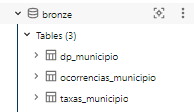
  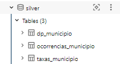
  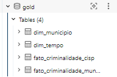
</p>

<p align="center">
  <em>Figura 1 — Evidências da estrutura e persistência das tabelas da camada Gold no Unity Catalog.</em>
</p>


## PIPELINE DE DADOS (Etapa 4.4)

O pipeline foi ramificado em notebooks separados por camada e por fonte, seguindo a Arquitetura Medalhão:

```text
setup_crime.ipynb                    → preparação do ambiente e criação dos schemas bronze, silver e gold
01_bronze_seguranca_rj.ipynb         → leitura dos 3 CSVs e persistência na camada Bronze
02_silver_dp_rj.ipynb                 → bronze.dp_municipio → silver.dp_municipio
02_silver_ocorrencias_rj.ipynb        → bronze.ocorrencias_municipio → silver.ocorrencias_municipio
02_silver_taxas_rj.ipynb              → bronze.taxas_municipio → silver.taxas_municipio
04_gold_seguranca_rj.py               → 3 tabelas Silver → 2 dimensões + 2 tabelas fato
05_analise_seguranca_rj.py            → qualidade dos dados + respostas às 6 perguntas
```

Optou-se por um notebook por tabela/camada (em vez de um único notebook monolítico) para isolar responsabilidades: cada notebook Silver trata uma única fonte, o que facilita debugar problemas de qualidade específicos de cada arquivo (como ocorreu com a duplicidade e o encoding, ambos isolados a uma única fonte).


#### Principais transformações por notebook

O pipeline foi dividido por camada e por fonte, mantendo cada notebook responsável por um conjunto específico de transformações.

#### `01_bronze_seguranca_rj`

**Objetivo:** realizar a ingestão dos arquivos originais e preservar os dados brutos.

- Leitura dos três arquivos CSV com `delimiter=";"` e `encoding="latin1"`;
- gravação das tabelas utilizando `mode("overwrite")`;
- manutenção da ingestão de forma idempotente, evitando duplicações em novas execuções;
- validação da quantidade de linhas do DataFrame de origem em relação à tabela Bronze persistida, interrompendo a execução caso haja divergência.

> Os arquivos disponibilizados pelo ISP-RJ contêm o histórico completo a cada download. Por isso, o uso de `append` poderia duplicar os registros em execuções posteriores.

---

#### `02_silver_dp_rj`

**Fonte:** `bronze.dp_municipio`

**Principais tratamentos:**

- conversão dos identificadores `cisp`, `aisp`, `risp` e `mcirc` para `string`;
- tratamento de valores nulos com `coalesce()` em indicadores específicos;
- remoção de duplicatas exatas;
- resolução de registros duplicados por revisão de `fase`, mantendo a versão mais recente;
- correção do problema de encoding no campo `regiao`;
- padronização de `Grande Niterói`.

---

#### `02_silver_ocorrencias_rj`

**Fonte:** `bronze.ocorrencias_municipio`

**Principais tratamentos:**

- conversão de `fmun_cod` para `string`;
- tratamento de valores nulos em `feminicidio` e `tentativa_feminicidio`;
- criação de `data_referencia` a partir dos campos `ano` e `mes`;
- padronização dos dados para uso nas etapas posteriores do pipeline.

---

#### `02_silver_taxas_rj`

**Fonte:** `bronze.taxas_municipio`

**Principais tratamentos:**

- substituição da vírgula pelo ponto nos valores decimais;
- conversão de `53` colunas de taxas para `double`;
- conversão de `fmun_cod` para `string`;
- tratamento dos `3` registros com `regiao = NULL`, utilizando `NAO_INFORMADO`.

---

#### `04_gold_seguranca_rj`

**Objetivo:** construir o modelo analítico utilizado nas análises.

Antes da criação das tabelas finais, são realizadas validações automáticas:

- verificação das colunas obrigatórias do schema;
- verificação de duplicidade das chaves;
- interrupção da execução com `ValueError` caso alguma validação crítica falhe;
- checagem de consistência do indicador `letalidade_violenta`.

A camada Gold gera:

```text
dim_tempo
dim_municipio
fato_criminalidade_municipio
fato_criminalidade_cisp

```
Também são criadas as principais métricas derivadas utilizadas nas análises:

```text
crimes_violentos
atividade_policial
crimes_patrimoniais
veiculos_subtraidos
indice_recuperacao_veiculos
crimes_patrimoniais_mes_seguinte
variacao_crimes_mes_seguinte
```

#### 05_analise_seguranca_rj

**Objetivo:** avaliar a qualidade dos dados e responder às seis perguntas de negócio.

Nesta etapa são realizados:
- perfil estatístico das principais métricas;
- identificação de possíveis outliers pelo método IQR;
- checagens adicionais de qualidade;
- cruzamento entre outliers e concentração por CISP;
- consultas analíticas para as seis perguntas de negócio;
- geração das tabelas e visualizações utilizadas no README.


#### Referência aos scripts no GitHub: 

- [`01_bronze_seguranca_rj.ipynb`](notebooks/01_bronze_seguranca_rj.ipynb)
- [`02_silver_dp_rj.ipynb`](notebooks/02_silver_dp_rj.ipynb)
- [`02_silver_ocorrencias_rj.ipynb`](notebooks/02_silver_ocorrencias_rj.ipynb)
- [`02_silver_taxas_rj.ipynb`](notebooks/02_silver_taxas_rj.ipynb)
- [`04_gold_seguranca_rj.py`](notebooks/04_gold_seguranca_rj.py)
- [`05_analise_seguranca_rj.py`](notebooks/05_analise_seguranca_rj.py)
- [`setup_crime.ipynb`](notebooks/setup_crime.ipynb)

<p align="center">
  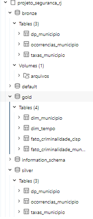
</p>

<p align="center">
  <em>Figura 2 — Evidência das tabelas persistidas no ambiente Databricks após a execução do pipeline.</em>
</p>

## QUALIDADE DOS DADOS (Etapa 4.5)


Ao longo do pipeline foram identificados problemas de qualidade, diferenças de cobertura e situações que exigiram tratamentos ou validações específicas. Essas verificações foram realizadas principalmente nas camadas Silver e Gold, antes da utilização dos dados nas análises.

### 1. Duplicidade por revisão de dados (`fase`) — `dp_municipio`

A base `BaseDPEvolucaoMensalCisp.csv` apresenta, em alguns dos meses mais recentes, mais de um registro para a mesma combinação de `cisp`, `munic`, `ano` e `mes`.

Isso ocorre porque os dados podem aparecer em diferentes fases de consolidação:

```text
fase = 2 → consolidado sem errata
fase = 3 → consolidado com errata
```

Em alguns meses de 2026 também foram encontradas repetições exatas de registros com `fase = 2`.

**Tratamento:** na camada Silver, no notebook `02_silver_dp_rj`, as duplicatas exatas foram removidas utilizando:

```python
dropDuplicates()
```

Nos casos em que existiam diferentes fases para a mesma chave, foi mantido o registro com a maior `fase`, representando a versão mais recente disponível.

Para isso, foi utilizada uma janela com:

```python
row_number()
```

particionada pelas colunas:

```text
cisp, munic, ano, mes
```

e ordenada por `fase` de forma decrescente.

<p align="center">
  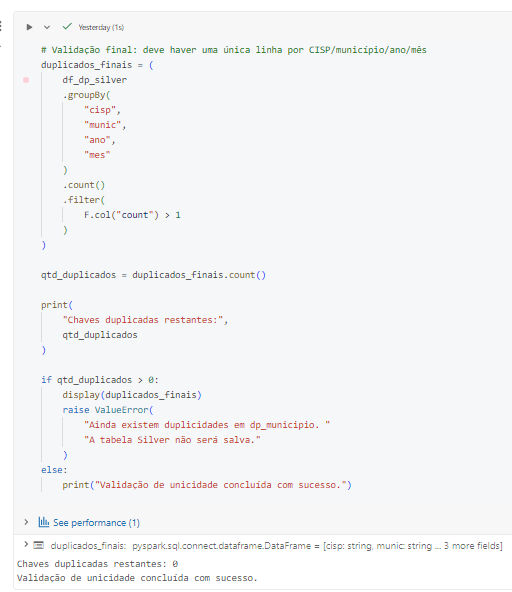
</p>

<p align="center">
  <em>Figura 3 — Evidência do tratamento de registros duplicados em <code>dp_municipio</code>, priorizando a maior <code>fase</code> para cada chave temporal.</em>
</p>


---

### 2. Problema de encoding no campo `regiao` — `dp_municipio`

O valor `Grande Niterói` apresentava problemas de codificação em parte dos registros da base bruta, aparecendo em formatos corrompidos como:

```text
Grande NiterÃ\x83Â\x83Ã\x82Â\x83Ã\x83Â\x82Ã\x82³i
```

Sem tratamento, esses valores poderiam ser interpretados como regiões diferentes, prejudicando principalmente as análises agregadas por região.

**Tratamento:** o campo `regiao` foi normalizado na camada Silver. Valores contendo o radical:

```text
Niter
```

foram padronizados para:

```text
Grande Niterói
```

Dessa forma, os registros passaram a utilizar uma única representação da região.

<p align="center">
  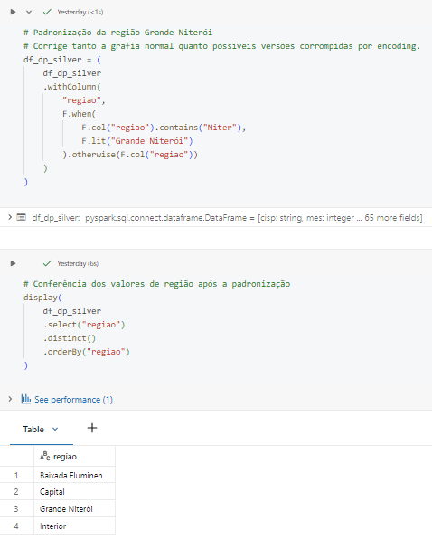
</p>

<p align="center">
  <em>Figura 4 — Evidência da padronização do campo <code>regiao</code>, unificando os registros de Grande Niterói.</em>
</p>
---

### 3. Cobertura temporal diferente entre as fontes

As três fontes utilizadas no projeto não possuem exatamente o mesmo período de cobertura.

```text
dp_municipio            → 2003 a 2026
ocorrencias_municipio   → 2014 a 2026
taxas_municipio         → 2014 a 2024
```

A tabela `taxas_municipio` termina em dezembro de 2024, enquanto as tabelas de ocorrências continuam até 2026.

**Tratamento:** essa diferença foi documentada e mantida no modelo, sem preenchimento artificial de valores inexistentes.

Por isso, a coluna:

```text
letalidade_violenta_taxa
```

fica como `NULL` para 2025 e 2026.

Para a análise de recuperação de veículos foi utilizado o indicador `indice_recuperacao_veiculos`, calculado diretamente a partir das contagens disponíveis.

---

### 4. Consistência de `letalidade_violenta` e seus componentes

O indicador `letalidade_violenta` foi comparado com a soma dos quatro componentes utilizados em sua definição:

```text
letalidade_calculada =
hom_doloso
+ lesao_corp_morte
+ latrocinio
+ hom_por_interv_policial
```
Na tabela utilizada para a construção da fato_criminalidade_cisp, foram encontradas divergências em 173 de 38.273 registros analisados, correspondendo a aproximadamente 0,45%.
Essas divergências não foram corrigidas automaticamente pelo pipeline, pois os valores já estavam presentes dessa forma na fonte original. A verificação foi mantida na camada Gold como uma checagem de consistência, permitindo acompanhar esse percentual a cada nova execução.

<p align="center">
  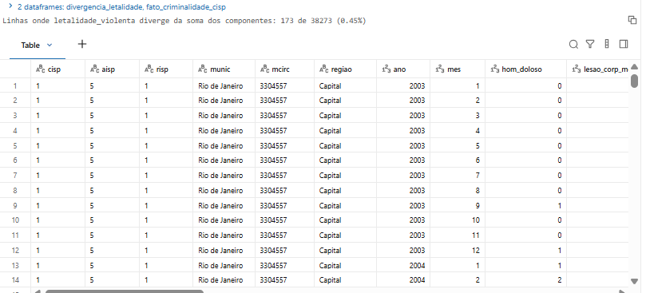
</p>

<p align="center">
  <em>Figura 5 — Verificação da consistência entre o indicador <code>letalidade_violenta</code> e a soma de seus componentes, com 173 divergências em 38.273 registros analisados (0,45%).</em>
</p>

---

### 5. Validações automáticas de schema e duplicidade — Gold

O notebook `04_gold_seguranca_rj` realiza validações antes da persistência das tabelas finais.

#### Validação de schema

O pipeline verifica se todas as colunas necessárias estão presentes nas tabelas Silver.

Caso alguma coluna obrigatória esteja ausente, a execução é interrompida com:

```python
ValueError
```

Isso evita a criação de tabelas Gold incompletas.

#### Validação de duplicidade

Também são verificadas duplicidades de chave nas tabelas utilizadas e nas tabelas fato geradas:

```text
fato_criminalidade_municipio
fato_criminalidade_cisp
```

Caso seja encontrada uma chave duplicada, a execução é interrompida para que o problema seja analisado antes da persistência.

---

### 6. `indice_recuperacao_veiculos` acima de 1

O índice de recuperação de veículos foi calculado como:

```text
indice_recuperacao_veiculos =
recuperacao_veiculos / veiculos_subtraidos
```

sendo:

```text
veiculos_subtraidos = roubo_veiculo + furto_veiculos
```

Como os dados são agregados mensalmente, um veículo recuperado em determinado mês pode ter sido roubado ou furtado em um período anterior.

Por isso, o indicador pode apresentar valores superiores a `1` sem representar necessariamente um erro na base.

Na análise foram encontradas:

```text
899 linhas com índice > 1
9.542 linhas com índice calculado
Percentual: 9,42%
```

Esses valores não foram removidos ou limitados, pois fazem parte da característica do indicador e foram considerados uma limitação metodológica da análise.

<p align="center">
  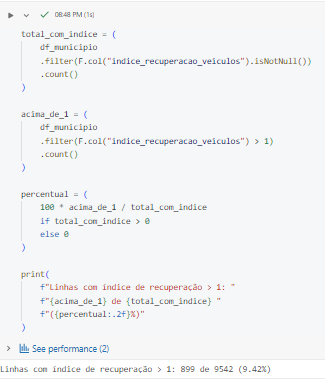
</p>

<p align="center">
  <em>Figura 6 — Verificação dos registros em que o índice de recuperação de veículos é superior a 1.</em>
</p>

---

### 7. Valores nulos — feminicídio e tentativa de feminicídio

Nas tabelas `dp_municipio` e `ocorrencias_municipio`, os campos:

```text
feminicidio
tentativa_feminicidio
```

apresentavam valores `NULL` em períodos anteriores à disponibilidade desses indicadores.

Na camada Silver, esses valores foram tratados utilizando:

```python
coalesce()
```

substituindo:

```text
NULL → 0
```

Essa transformação evita problemas em operações posteriores de soma e agregação.

Entretanto, os zeros anteriores ao período válido **não foram interpretados como ausência de ocorrências**.

Por esse motivo, a análise de feminicídio e tentativa de feminicídio considera somente registros a partir de:

```text
2024-10-01
```

---

### 8. Tratamento das taxas — separador decimal e conversão para `double`

Na tabela `taxas_municipio`, os valores numéricos estavam armazenados utilizando vírgula como separador decimal.

Exemplo:

```text
"0,55" → 0.55
```

Para permitir cálculos no Spark, a vírgula foi substituída por ponto e as `53` colunas de taxas foram convertidas para:

```text
double
```

Esse tratamento permite realizar corretamente operações como médias, comparações, ordenações e agregações numéricas.

#### Valores nulos em `regiao`

Foram encontrados `3` registros com valor nulo na coluna:

```text
regiao
```

Esses registros foram preservados e o valor ausente foi substituído por:

```text
NAO_INFORMADO
```

Dessa forma, nenhuma região foi atribuída artificialmente aos registros.

---

### 9. Tipagem dos códigos identificadores

Campos utilizados como identificadores foram convertidos para `string`, entre eles:

```text
cisp
aisp
risp
mcirc
fmun_cod
```

Apesar de esses campos serem formados por números, eles representam códigos de identificação e não valores destinados a operações matemáticas.

Por isso, o tipo `string` representa melhor sua utilização no modelo.

---

### 10. Criação da data de referência mensal

As bases utilizadas possuem granularidade mensal e apresentam apenas os campos:

```text
ano
mes
```

Como não existe informação sobre o dia específico da ocorrência, foi criada a coluna:

```text
data_referencia
```

utilizando o primeiro dia do mês como uma convenção.

Exemplo:

```text
ano = 2024 e mes = 10 → data_referencia = 2024-10-01
```

O valor `01` **não representa o dia em que a ocorrência aconteceu**. Ele é utilizado somente para transformar a combinação de `ano` e `mes` em uma data válida.

Essa padronização facilita:

- ordenação cronológica;
- criação da dimensão de tempo;
- construção de gráficos de série temporal;
- utilização de funções temporais do Spark;
- identificação do mês seguinte nas análises.


### Checagens de completude, consistência, unicidade e acurácia

Além dos problemas identificados anteriormente, foram realizadas verificações sistemáticas nas tabelas da camada Silver.

- **Completude:** foi realizada a contagem de valores nulos por coluna utilizando operações como `groupBy()`, `agg()`, `count()`, `when()` e `isNull()`. Os principais valores ausentes encontrados estavam relacionados a indicadores que passaram a ser registrados apenas a partir de determinados períodos e aos `3` registros com `regiao = NULL` na tabela `taxas_municipio`.

- **Unicidade:** foram verificadas possíveis duplicidades nas chaves principais das três tabelas Silver:

```text
dp_municipio           → cisp + munic + ano + mes
ocorrencias_municipio  → fmun_cod + ano + mes
taxas_municipio        → fmun_cod + ano + mes
```

O problema de duplicidade foi identificado principalmente em `dp_municipio` e tratado conforme descrito anteriormente, utilizando remoção de registros idênticos e seleção da maior `fase` para cada chave temporal.

- **Consistência:** também foram avaliados os valores do campo `regiao`, verificando se as categorias estavam padronizadas. O principal problema encontrado ocorreu em `dp_municipio`, onde `Grande Niterói` apresentava problemas de encoding. Após o tratamento, os valores foram normalizados.

- **Acurácia e plausibilidade:** foram avaliadas relações internas entre indicadores para verificar se os valores apresentavam comportamento coerente com suas definições. Entre essas verificações estão a relação entre `letalidade_violenta` e seus quatro componentes e a análise dos casos em que `indice_recuperacao_veiculos > 1`. As divergências encontradas foram investigadas e documentadas, sem alteração automática dos valores originais.

---

### Estatística descritiva e análise de outliers

No notebook `05_analise_seguranca_rj`, foi realizado um perfil estatístico das principais métricas de `fato_criminalidade_cisp`, cujo grão é:

```text
CISP × mês
```

Para identificação de possíveis valores extremos foi utilizado o método do intervalo interquartil (`IQR`), normalmente utilizado em boxplots.

O cálculo considera:

```text
IQR = Q3 - Q1

Limite inferior = Q1 - 1,5 × IQR
Limite superior = Q3 + 1,5 × IQR
```

Um valor é considerado outlier quando fica abaixo do limite inferior ou acima do limite superior.

| Métrica | Média | Mediana | Q1 | Q3 | Limite inferior | Limite superior | Outliers | % |
|---|---:|---:|---:|---:|---:|---:|---:|---:|
| `crimes_violentos` | 53,75 | 39 | 17 | 72 | -65,5 | 154,5 | 1.883 | 4,92% |
| `letalidade_violenta` | 3,63 | 2 | 0 | 5 | -7,5 | 12,5 | 2.629 | 6,87% |
| `crimes_patrimoniais` | 144,52 | 91 | 19 | 217 | -278 | 514 | 1.310 | 3,42% |
| `atividade_policial` | 24,42 | 17 | 5 | 35 | -40 | 80 | 1.707 | 4,46% |

### Leitura dos resultados

Os limites inferiores calculados pelo método do `IQR` foram negativos em todas as quatro métricas. Como esses indicadores representam contagens e, portanto, não assumem valores negativos, os outliers identificados estão concentrados na parte superior da distribuição.

Esses valores extremos não foram removidos automaticamente, pois podem representar diferenças reais entre CISPs e períodos, e não necessariamente erros de qualidade dos dados.

Outro comportamento observado foi que a **média ficou acima da mediana nas quatro métricas**. Isso indica distribuições assimétricas à direita, nas quais a maior parte dos registros apresenta valores relativamente menores, enquanto alguns CISP-mês possuem valores elevados e aumentam a média geral.

Esse comportamento também é compatível com a análise da Pergunta 2, que mostrou que determinados CISPs apresentam volumes de crimes patrimoniais superiores aos demais.

A métrica `letalidade_violenta` apresentou a maior proporção de outliers, com **6,87%**. Entretanto, seus valores absolutos são relativamente baixos:

```text
Mediana = 2
Q3      = 5
```

Dessa forma, pequenas variações no número mensal de registros podem ultrapassar o limite superior calculado pelo `IQR`. Por esse motivo, esses valores foram mantidos na análise e tratados como pontos de investigação, e não como erros que deveriam ser removidos.

De forma geral, a análise de outliers foi utilizada como uma ferramenta de diagnóstico da distribuição dos dados. Os valores extremos encontrados foram preservados, pois podem representar situações reais de maior concentração de ocorrências em determinados locais ou períodos.

#### Cruzamento dos outliers com a Pergunta 2

O cruzamento entre os outliers de `crimes_patrimoniais` e o ranking da Pergunta 2 mostrou que, entre os `966` registros classificados como outliers na Capital, `637` pertencem às cinco CISPs com maior volume acumulado de crimes patrimoniais.

Isso corresponde a **65,9% dos outliers**, indicando que essas CISPs não apenas concentram maior volume total de ocorrências, mas também aparecem com maior frequência entre os meses com valores excepcionalmente altos.

Esse resultado reforça a evidência de concentração geográfica observada na Pergunta 2.

<p align="center">
  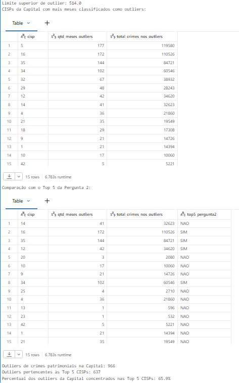
</p>

<p align="center">
  <em>Figura 7 — Cruzamento dos outliers de <code>crimes_patrimoniais</code> da Capital com as cinco CISPs de maior volume acumulado, que concentram 65,9% dos registros classificados como outliers.</em>
</p>


## ANÁLISE DE DADOS (Etapa 4.5)


<p align="justify">
&emsp;&emsp;As consultas, tabelas e gráficos completos utilizados nesta etapa estão disponíveis no notebook `05_analise_seguranca_rj`. A seguir são apresentados os principais resultados obtidos para cada uma das seis perguntas de negócio definidas no início do projeto.
</p>


### Pergunta 1 — Como o volume de crimes violentos evoluiu por região do Estado do Rio de Janeiro entre 2003 e 2026?

<p align="center">
  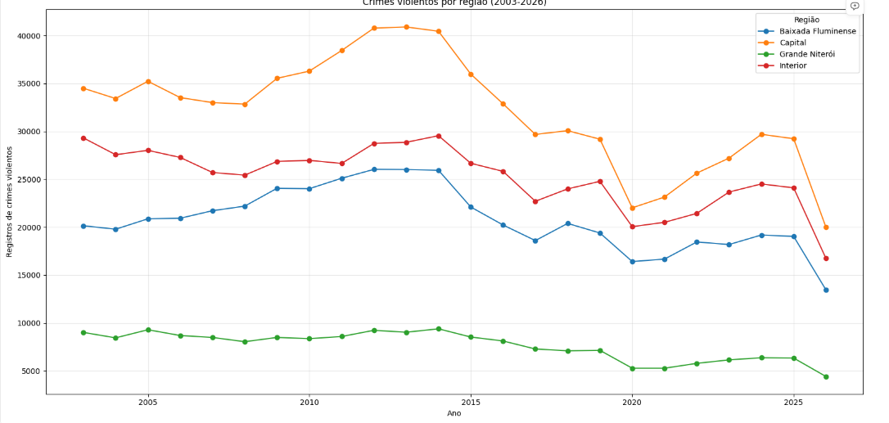
</p>

<p align="center">
  <em>Figura 8 — Evolução dos registros de crimes violentos por região do Estado do Rio de Janeiro entre 2003 e 2026.</em>
</p>

<p align="justify">
&emsp;&emsp;A análise mostra que a evolução dos registros de crimes violentos não ocorreu da mesma forma em todas as regiões do Estado do Rio de Janeiro. Cada região atingiu seu maior volume em um momento diferente da série histórica.
</p>

<p align="justify">
&emsp;&emsp;A Capital apresentou o maior pico absoluto, com <strong>40.899 registros em 2013</strong>. No Interior, o maior valor foi observado em <strong>2014, com 29.545 registros</strong>. A Baixada Fluminense alcançou seu pico em <strong>2012, com 26.032 registros</strong>, enquanto Grande Niterói apresentou seu maior volume em <strong>2014, com 9.387 registros</strong>.
</p>

<p align="justify">
&emsp;&emsp;Esses resultados mostram que a concentração dos registros varia tanto entre as regiões quanto ao longo do tempo. A Capital apresentou o maior volume absoluto entre as quatro regiões, mas essa comparação deve ser feita com cautela, pois os valores utilizados são contagens absolutas e não foram normalizados pela população ou pela quantidade de CISPs de cada região.
</p>

<p align="justify">
&emsp;&emsp;Também foi verificada a cobertura temporal dos dados. Os anos completos possuem os 12 meses disponíveis, enquanto <code>2026</code> apresenta registros somente até agosto. Por esse motivo, o total de 2026 não deve ser comparado diretamente com os anos completos como evidência de aumento ou redução da criminalidade.
</p>

<p align="center">
  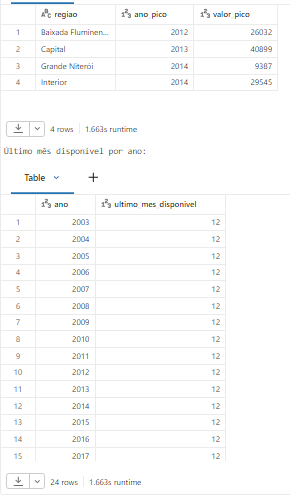
</p>

<p align="center">
  <em>Figura 9 — Verificação da cobertura temporal da série histórica, evidenciando que os dados de 2026 estão disponíveis somente até agosto.</em>
</p>

<p align="justify">
&emsp;&emsp;Assim, a análise permite identificar os principais picos históricos e as diferenças regionais na evolução dos registros, mas comparações proporcionais entre as regiões exigiriam indicadores normalizados, como taxas por população.
</p>

---

### Pergunta 2 — Quais CISPs da Capital concentram os maiores volumes de crimes patrimoniais, considerando roubo de rua e furtos?

<p align="center">
  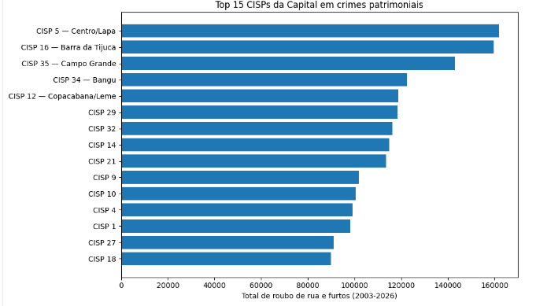
</p>

<p align="center">
  <em>Figura 10 — Ranking das CISPs da Capital por volume acumulado de crimes patrimoniais, considerando roubo de rua e total de furtos.</em>
</p>

<p align="justify">
&emsp;&emsp;A análise dos registros de crimes patrimoniais da Capital, considerando a soma de <code>roubo_rua</code> e <code>total_furtos</code>, mostrou que os maiores volumes estão concentrados em algumas CISPs específicas.
</p>

<p align="justify">
&emsp;&emsp;No período analisado, as cinco CISPs com maior volume foram a <strong>CISP 5 (Centro/Lapa)</strong>, <strong>CISP 16 (Barra da Tijuca)</strong>, <strong>CISP 35 (Campo Grande)</strong>, <strong>CISP 34 (Bangu)</strong> e <strong>CISP 12 (Copacabana/Leme)</strong>. Entre elas, a CISP 5 apresentou o maior volume acumulado de registros.
</p>

<p align="justify">
&emsp;&emsp;As cinco CISPs com maior volume concentraram <strong>22,1% de todos os registros de crimes patrimoniais da Capital</strong>. Isso mostra uma concentração relativa em determinadas circunscrições, embora aproximadamente <strong>77,9%</strong> dos registros estejam distribuídos entre as demais CISPs.
</p>

<p align="justify">
&emsp;&emsp;A análise utiliza valores absolutos acumulados. Portanto, os resultados indicam onde houve maior quantidade de registros, mas não representam necessariamente maior risco proporcional. Fatores como população residente, circulação diária de pessoas, atividade comercial e extensão territorial das CISPs não foram considerados nessa comparação.
</p>

---

### Pergunta 3 — Existe associação entre a atividade policial de um mês e a quantidade de crimes patrimoniais registrada no mês seguinte?

<p align="center">
  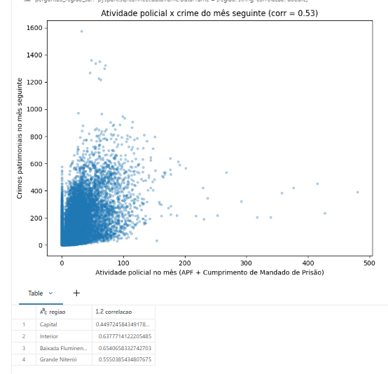
</p>

<p align="center">
  <em>Figura 11 — Relação entre a atividade policial de um mês e o volume de crimes patrimoniais registrado no mês seguinte.</em>
</p>

<p align="justify">
&emsp;&emsp;A análise comparou a atividade policial registrada em cada CISP, medida pela soma de prisões em flagrante (<code>apf</code>) e cumprimento de mandados de prisão (<code>cmp</code>), com a quantidade de crimes patrimoniais registrada no mês seguinte.
</p>

<p align="justify">
&emsp;&emsp;A correlação geral encontrada foi de <strong>0,528</strong>, indicando uma associação positiva de magnitude moderada entre as duas variáveis. Isso significa que, nos dados analisados, meses com maior atividade policial tendem a estar associados a maiores volumes de crimes patrimoniais no mês seguinte.
</p>

A correlação por região foi:

```text
Baixada Fluminense   → 0,654
Interior             → 0,638
Grande Niterói       → 0,555
Capital              → 0,450
```

<p align="justify">
&emsp;&emsp;A associação foi positiva em todas as regiões. A Baixada Fluminense apresentou a maior correlação, seguida pelo Interior e por Grande Niterói. A Capital apresentou o menor valor entre as quatro regiões.
</p>

<p align="justify">
&emsp;&emsp;Entretanto, esse resultado não deve ser interpretado como uma relação de causa e efeito. A correlação mostra apenas que as duas variáveis variam juntas em certa medida. Regiões com maiores níveis de criminalidade também podem apresentar maior atuação policial, o que pode contribuir para a associação observada.
</p>

<p align="justify">
&emsp;&emsp;Além disso, a análise considerou somente os casos em que o registro seguinte correspondia realmente ao mês seguinte para o mesmo CISP. Essa validação foi realizada na Gold por meio de <code>LEAD</code> e <code>add_months()</code>, evitando comparações entre meses não consecutivos.
</p>

<p align="justify">
&emsp;&emsp;Assim, os dados indicam uma <strong>associação temporal positiva</strong> entre atividade policial e crimes patrimoniais do mês seguinte, mas não permitem concluir que o aumento da atividade policial provoque aumento ou redução da criminalidade.
</p>

---

### Pergunta 4 — Como o índice de recuperação de veículos evoluiu ao longo dos anos e entre as regiões?

<p align="center">
  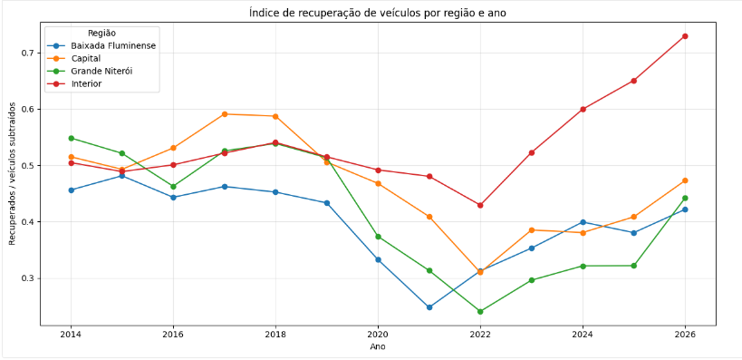
</p>

<p align="center">
  <em>Figura 12 — Evolução do índice de recuperação de veículos por região e ano.</em>
</p>

<p align="justify">
&emsp;&emsp;O índice de recuperação de veículos apresentou variações importantes entre as regiões ao longo do período analisado. Entre 2019 e 2022 houve queda em boa parte das regiões, seguida por recuperação nos anos posteriores.
</p>

<p align="justify">
&emsp;&emsp;O Interior apresentou a recuperação mais forte, chegando a aproximadamente <strong>0,73 em 2026</strong>. Capital, Baixada Fluminense e Grande Niterói também apresentaram melhora após 2022, mas de forma mais gradual.
</p>

<p align="justify">
&emsp;&emsp;Também foram identificadas <strong>899 linhas com <code>indice_recuperacao_veiculos &gt; 1</code></strong>, correspondendo a <strong>9,42%</strong> dos registros com índice calculado.
</p>

```text
899 linhas com índice > 1
9.542 linhas com índice calculado
Percentual: 9,42%
```

<p align="justify">
&emsp;&emsp;Esses casos não foram considerados automaticamente como erro, pois um veículo recuperado em determinado mês pode ter sido roubado ou furtado em um período anterior. Dessa forma, o indicador representa uma relação agregada entre recuperações e subtrações e não o acompanhamento individual dos mesmos veículos.
</p>

<p align="justify">
&emsp;&emsp;Os dados de <code>2026</code> estão incompletos e, portanto, devem ser interpretados com cautela.
</p>

---

### Pergunta 5 — Como evoluíram mensalmente os registros de feminicídio e tentativa de feminicídio a partir de outubro de 2024?

<p align="center">
  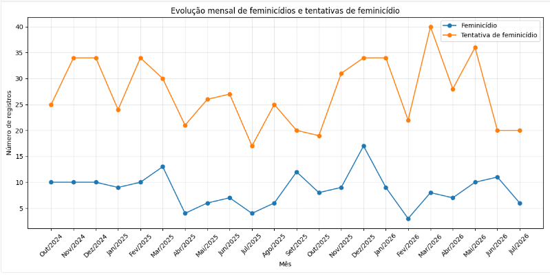
</p>

<p align="center">
  <em>Figura 13 — Evolução mensal dos registros de feminicídio e tentativa de feminicídio a partir de outubro de 2024.</em>
</p>

<p align="justify">
&emsp;&emsp;A partir de <code>2024-10-01</code>, foram registrados <strong>189 feminicídios</strong> e <strong>601 tentativas de feminicídio</strong> no período analisado.
</p>

<p align="justify">
&emsp;&emsp;O maior número mensal de feminicídios ocorreu em <strong>dezembro de 2025</strong>, com <strong>17 registros</strong>. Já o maior número de tentativas de feminicídio foi observado em <strong>março de 2026</strong>, com <strong>40 registros</strong>.
</p>

<p align="center">
  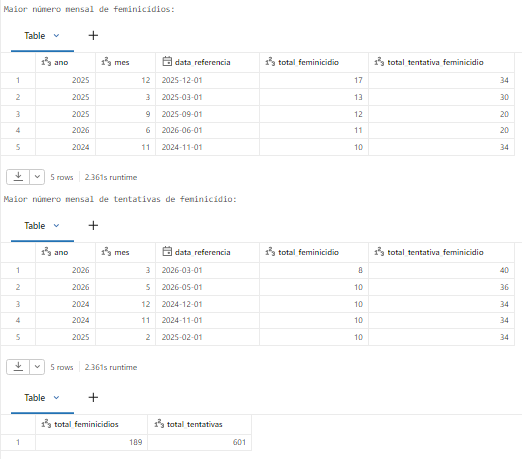
</p>

<p align="center">
  <em>Figura 14 — Destaque dos maiores registros mensais de feminicídio e tentativa de feminicídio no período analisado.</em>
</p>

<p align="justify">
&emsp;&emsp;Os dados apresentam oscilações mensais, sem uma tendência contínua de crescimento ou queda. As tentativas de feminicídio permaneceram, em geral, acima dos registros de feminicídio durante o período analisado.
</p>

<p align="justify">
&emsp;&emsp;A análise considera somente os registros a partir de outubro de 2024, evitando interpretar os valores anteriores, que não possuem a mesma cobertura do indicador, como ausência de ocorrências.
</p>

<p align="justify">
&emsp;&emsp;Os dados de <code>2026</code> também são parciais, pois o ano ainda não está completo no conjunto analisado.
</p>

---

### Pergunta 6 — Quais meses apresentam os maiores registros de roubo de rua e roubo a estabelecimento comercial em cada ano, e esses meses de maior ocorrência se repetem ao longo dos anos?

<p align="center">
  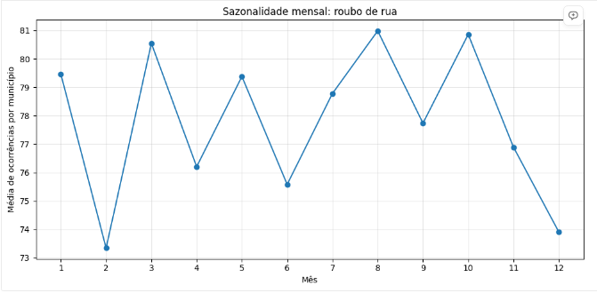
</p>

<p align="center">
  <em>Figura 15 — Distribuição mensal dos registros de roubo de rua utilizada na análise de sazonalidade.</em>
</p>

<p align="center">
  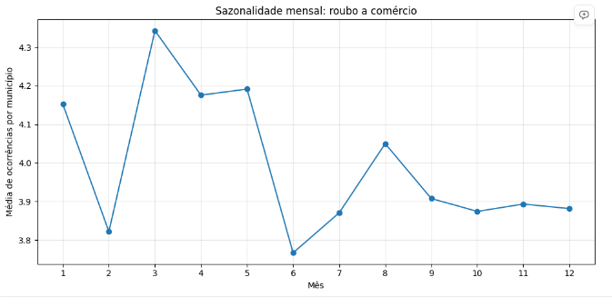
</p>

<p align="center">
  <em>Figura 16 — Distribuição mensal dos registros de roubo a estabelecimento comercial utilizada na análise de sazonalidade.</em>
</p>

<p align="center">
  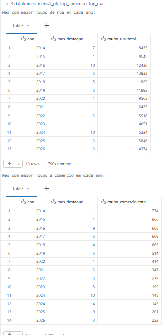
</p>

<p align="center">
  <em>Figura 17 — Identificação dos meses de maior ocorrência de roubo de rua ao longo dos anos analisados.</em>
</p>

<p align="center">
  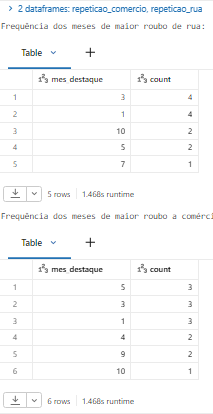
</p>

<p align="center">
  <em>Figura 18 — Identificação dos meses de maior ocorrência de roubo a estabelecimento comercial ao longo dos anos analisados.</em>
</p>

<p align="justify">
&emsp;&emsp;A análise mostrou que os meses de maior ocorrência variam de um ano para outro, mas alguns aparecem com maior frequência.
</p>

<p align="justify">
&emsp;&emsp;No <code>roubo_rua</code>, janeiro e março foram os meses que mais apareceram como o maior registro anual, ocorrendo em <strong>4 anos cada</strong>. Outubro e maio apareceram em <strong>2 anos</strong>, enquanto julho apareceu em <strong>1 ano</strong>.
</p>

```text
Roubo de rua

Janeiro   → 4 anos
Março     → 4 anos
Outubro   → 2 anos
Maio      → 2 anos
Julho     → 1 ano
```

<p align="justify">
&emsp;&emsp;No <code>roubo_comercio</code>, janeiro, março e maio foram os meses mais recorrentes, aparecendo como o maior registro anual em <strong>3 anos cada</strong>. Abril e setembro apareceram em <strong>2 anos cada</strong>, enquanto outubro apareceu em <strong>1 ano</strong>. Em 2024 ocorreu um empate entre abril e outubro, ambos com <strong>145 registros</strong>, por isso os dois meses foram considerados como picos daquele ano.
</p>


```text
Roubo a estabelecimento comercial

Janeiro    → 3 anos
Março      → 3 anos
Maio       → 3 anos
Abril      → 2 anos
Setembro   → 2 anos
Outubro    → 1 ano
```

<p align="justify">
&emsp;&emsp;Assim, não existe um único mês que concentre os maiores registros em todos os anos. Entretanto, a repetição de alguns meses, principalmente janeiro e março, indica um padrão sazonal parcial, que varia de acordo com o tipo de crime e com o ano analisado.
</p>

<p align="justify">
&emsp;&emsp;Os dados de <code>2026</code> são parciais. Portanto, o mês de maior ocorrência desse ano ainda pode mudar quando a série estiver completa.
</p>

---

### Discussão Geral


O objetivo deste MVP foi entender como a criminalidade no Estado do Rio de Janeiro evoluiu ao longo do tempo, identificar concentrações geográficas e verificar se a atividade policial apresenta alguma associação com os indicadores de criminalidade. A análise das seis perguntas mostra que não existe um único comportamento para todo o estado: os resultados variam de acordo com a região, o período e o tipo de ocorrência analisado.

Na evolução dos crimes violentos, os maiores picos regionais ficaram concentrados entre **2012 e 2014**. A Capital apresentou o maior valor absoluto, com **40.899 registros em 2013**, enquanto Baixada Fluminense, Interior e Grande Niterói atingiram seus máximos em anos próximos. Isso mostra que os períodos de maior volume não ocorreram exatamente no mesmo momento em todas as regiões, reforçando que a dinâmica da criminalidade apresenta diferenças territoriais.

A concentração geográfica também ficou evidente na análise das CISPs da Capital. As cinco CISPs com maior volume acumulado representaram **22,1% dos crimes patrimoniais**, mas concentraram **65,9% dos meses classificados como outliers de `crimes_patrimoniais`**. Isso indica que determinadas áreas não apenas apresentam volumes elevados no acumulado, mas também aparecem com maior frequência em períodos de ocorrência excepcionalmente alta.

Na relação entre atividade policial e criminalidade, foi encontrada uma correlação geral de **0,528** entre a atividade policial de um mês e os crimes patrimoniais registrados no mês seguinte. A associação foi positiva em todas as regiões, embora com intensidades diferentes. Esse resultado mostra que existe uma relação estatística entre as variáveis, mas não permite afirmar que uma provoque a outra. Uma possível explicação é que áreas com maior criminalidade também demandem maior atuação policial.

Entre 2019 e 2022, período que inclui os anos mais afetados pela pandemia de COVID-19, foi observada redução no índice de recuperação de veículos em boa parte das regiões. Embora essa coincidência temporal possa ter relação com mudanças na circulação de pessoas, na mobilidade urbana e na dinâmica das ocorrências durante o período, os dados analisados neste MVP não permitem afirmar uma relação de causa e efeito.

Nos indicadores de feminicídio e tentativa de feminicídio, o período disponível ainda é curto para identificar uma tendência de longo prazo. A partir de outubro de 2024, foram observadas oscilações mensais, sem crescimento ou queda contínuos, e as tentativas permaneceram, em geral, acima dos registros de feminicídio. Por isso, essa análise deve ser vista como um acompanhamento inicial do comportamento desses indicadores.

Também foi identificado um **padrão sazonal parcial** nos roubos. Janeiro e março apareceram repetidamente entre os meses de maior ocorrência de roubo de rua, enquanto janeiro, março e maio se destacaram no roubo a estabelecimento comercial. Como esses meses não se repetem de forma idêntica em todos os anos, não existe uma sazonalidade completamente regular, mas há sinais de concentração temporal em determinados períodos.

Assim, a principal conclusão do MVP é que a criminalidade no Rio de Janeiro apresenta uma dinâmica **territorial e temporalmente desigual**. Os registros se concentram mais em determinados locais e períodos, alguns indicadores apresentam ciclos de queda e recuperação e existem padrões mensais que se repetem parcialmente. A atividade policial também apresenta associação com o comportamento da criminalidade, mas os dados utilizados não permitem estabelecer causalidade.

Dessa forma, o pipeline permitiu transformar as bases públicas do ISP-RJ em uma estrutura capaz de revelar padrões relevantes para o acompanhamento da segurança pública. Ao mesmo tempo, as análises mostram que comparações entre regiões precisam considerar fatores adicionais, como população, circulação de pessoas e características territoriais. Além disso, os dados de **2026 são parciais**, portanto seus resultados não devem ser tratados como tendência anual definitiva.


## Autoavaliação

De forma geral, considero que os objetivos centrais do MVP foram atingidos: foi possível
construir um pipeline completo no Databricks, passando pelas camadas Bronze, Silver e Gold,
organizar os dados em tabelas fato e dimensão, e responder — mesmo que parcialmente em
alguns casos — às seis perguntas de negócio propostas no início do trabalho.

### Objetivos atingidos

As análises permitiram observar a evolução dos crimes violentos por região, identificar as
CISPs da Capital com maior volume de crimes patrimoniais, verificar a associação entre
atividade policial e crimes do mês seguinte, analisar o índice de recuperação de veículos,
acompanhar os registros de feminicídio e tentativa de feminicídio, e verificar a repetição de
meses com maiores registros de roubo de rua e roubo a comércio. Em paralelo, o pipeline
incorporou validações automáticas de schema e duplicidade, checagens de consistência entre
indicadores compostos e uma análise estatística de outliers — indo além do mínimo pedido para
a etapa de Qualidade de Dados.

### Objetivos não atingidos e limitações


- **Pergunta 1 (crimes violentos por região):** a comparação entre regiões ficou limitada a
  valores absolutos. Não normalizei por população nem pela quantidade de CISPs de cada
  região, então não dá para afirmar que a Capital é objetivamente "pior" que o Interior —
  apenas que registra mais ocorrências em números absolutos. Faltou incorporar dados de
  população do IBGE, que eu sabia desde o início que seriam necessários para uma comparação
  justa, mas não priorizei dentro do prazo do MVP.

- **Pergunta 2 (CISPs da Capital):** identifiquei o nome da delegacia manualmente só para as
  5 CISPs do ranking. Não construí uma tabela de correspondência completa entre código CISP
  e nome de delegacia, então o resultado fica pouco legível para quem não conhece os códigos
  de cor.

- **Pergunta 3 (atividade policial x crime do mês seguinte):** não consegui — e sabia desde o
  desenho da pergunta que não conseguiria, com os dados disponíveis — estabelecer causalidade.
  A correlação de 0,528 pode ser inteiramente explicada por causalidade reversa (regiões mais
  violentas naturalmente têm mais atividade policial), e o MVP não tem como isolar esse efeito
  sem um método mais robusto (ex.: modelo de painel com efeitos fixos por CISP), que não cheguei
  a implementar.

- **Pergunta 4 (índice de recuperação de veículos):** o índice mistura veículos subtraídos e
  recuperados no mesmo mês, mesmo sabendo que existe defasagem real entre o furto/roubo e a
  recuperação (por isso o índice passa de 1 em 9,42% dos casos). Não consegui reformular o
  cálculo para rastrear coortes de veículos ao longo do tempo — o índice atual é uma
  aproximação agregada, não um acompanhamento individual.

- **Pergunta 5 (feminicídio):** a janela útil de dados (out/2024 em diante) acabou sendo mais
  curta do que o esperado quando desenhei a pergunta original — não é suficiente para
  identificar uma tendência de longo prazo, só um acompanhamento inicial. Isso só ficou claro
  depois de investigar os nulos a fundo, o que me obrigou a reduzir o escopo temporal da
  pergunta no meio do projeto.

- **Pergunta 6 (sazonalidade):** o padrão encontrado é parcial — nenhum mês concentra o pico em
  todos os anos, só com maior frequência relativa (janeiro e março). Não aprofundei em por que
  esses meses especificamente se repetem (não investiguei hipóteses como período de férias ou
  fatores econômicos sazonais).

- **Divergência de 0,45% em `letalidade_violenta`:** identifiquei e documentei a inconsistência
  entre o indicador oficial e a soma dos seus componentes, mas não consegui investigar a causa
  raiz dentro do prazo do MVP — fica registrada como uma divergência da própria fonte, sem
  explicação definitiva.

- **Modelagem sem `dim_cisp`:** a decisão de remover essa dimensão resolveu o problema de
  simplicidade, mas manteve uma limitação real: não existe chave direta entre
  `fato_criminalidade_cisp` e `dim_municipio`, o que impede alguns cruzamentos que exigiriam o
  código IBGE do município a partir do grão CISP.

### Dificuldades encontradas

A maior dificuldade durante o desenvolvimento foi trabalhar com PySpark e entender como
organizar corretamente as transformações entre as camadas. No início, montar as tabelas Silver
e Gold exigiu bastante atenção, principalmente para definir as chaves, fazer os tratamentos sem
perder informação e entender como os dados deveriam chegar até a etapa de análise.

Outra dificuldade importante foi a qualidade da base original. Algumas tabelas estavam bastante
desorganizadas e apresentavam problemas como duplicidades, valores nulos, diferenças de tipo,
campos com vírgula como separador decimal e problemas de encoding. Na base por CISP, por
exemplo, foi necessário entender o campo `fase` para identificar por que existiam registros
repetidos e manter a versão mais atualizada de cada um. Também foi necessário corrigir o nome
de Grande Niterói, que aparecia com problemas de codificação — um problema que não apareceu em
nenhuma checagem de nulos e só foi encontrado ao inspecionar os valores distintos do campo.

Esses problemas fizeram da etapa Silver uma das partes mais trabalhosas do projeto, pois foi
necessário limpar, padronizar e validar os dados antes de utilizá-los. Na Gold, a principal
dificuldade foi transformar essas tabelas já tratadas em uma estrutura que realmente ajudasse a
responder às perguntas, criando as dimensões, as tabelas fato e as métricas derivadas utilizadas
nas análises — decidir, por exemplo, se uma métrica deveria ser calculada a partir de
componentes atômicos ou de um campo já pronto da fonte (caso de `crimes_violentos` vs.
`letalidade_violenta`) exigiu entender a fundo o que cada indicador realmente representa, não
só copiar colunas.

Apesar das dificuldades, o trabalho ajudou a entender melhor a função de cada camada da
arquitetura Medalhão e a importância de não realizar apenas transformações técnicas, mas também
validar se os dados fazem sentido antes de utilizá-los em uma análise.

## Trabalhos futuros

- Incorporar dados de população por município (IBGE) para normalizar comparações regionais na
  pergunta 1 sem o viés de tamanho populacional.
- Ampliar a identificação das CISPs, criando uma tabela de correspondência completa entre
  código da CISP e nome da delegacia (neste MVP, feito apenas para as 5 CISPs da pergunta 2).
- Investigar a causalidade da pergunta 3 com métodos mais robustos (ex.: modelos de painel com
  efeitos fixos por CISP).
- Investigar com maior profundidade a origem da divergência de ~0,45% entre `letalidade_violenta`
  e seus quatro componentes documentados.
- Reformular `indice_recuperacao_veiculos` para rastrear coortes de veículos ao longo de vários
  meses, em vez de comparar subtrações e recuperações apenas dentro do mesmo mês.
- Revisitar a pergunta 5 quando houver mais anos de dado disponível, para avaliar tendência de
  longo prazo em vez de apenas o acompanhamento inicial possível hoje.
- Automatizar a atualização mensal do pipeline conforme o ISP-RJ publica novos boletins.


